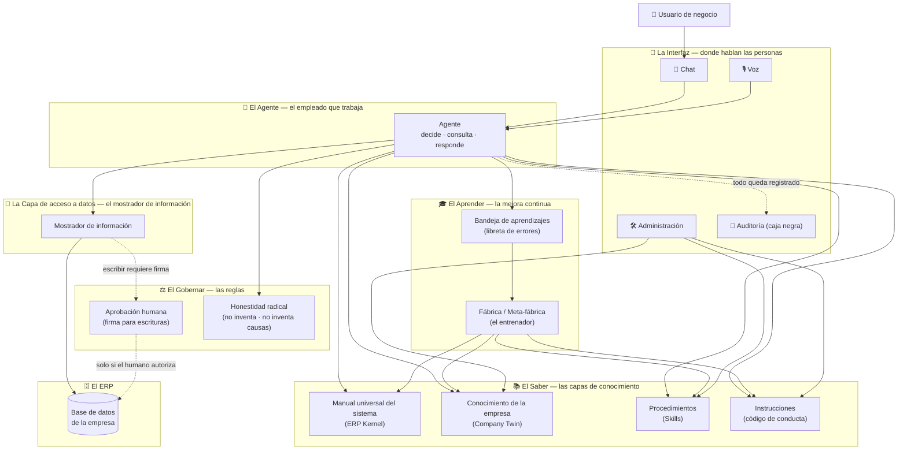

# Sigma — Anatomía de un asistente que habla el idioma de tu empresa

> Este documento explica **qué es Sigma y cómo está organizado por dentro**, en lenguaje
> sencillo, pensado para cualquier persona — sin necesidad de ser del equipo técnico.
> Si buscas el detalle técnico de implementación, consulta la documentación del proyecto.

---

## 1. Qué es Sigma (en una frase)

Sigma es un **asistente de inteligencia artificial** que entiende preguntas de negocio en
lenguaje natural ("¿qué nos falta comprar esta semana?", "¿cuánto gastamos en junio?") y las
responde **con datos reales de los sistemas de la empresa** (el ERP).

No es un chatbot genérico. Sigma:

- **Conoce la operación de tu empresa**: qué módulos usa, cuáles no, sus políticas, sus
  presupuestos, sus almacenes.
- **Sabe dónde están los datos** y cómo leerlos correctamente.
- **Se comporta con reglas claras**: no inventa, pide aprobación cuando toca, y aprende de
  sus errores.

> **Analogía:** imagina un **empleado de nuevo ingreso de primer nivel** que ya leyó todos
> los manuales de la empresa, tiene acceso a los sistemas de información, sigue un código de
> conducta estricto y cuenta con un **entrenador** que lo corrige cada vez que se equivoca.

---

## 2. La idea central: saber, hacer, aprender y gobernar

Todo el sistema se organiza en **cuatro bloques separados**, cada uno con una pregunta propia:

| Bloque | Pregunta | Analogía |
|---|---|---|
| **Saber** | ¿Qué conoce Sigma? | La biblioteca y los manuales |
| **Hacer** | ¿Cómo actúa y responde? | El empleado que trabaja |
| **Aprender** | ¿Cómo mejora con el tiempo? | El entrenador que lo corrige |
| **Gobernar** | ¿Qué reglas nunca se rompen? | El código de conducta y los controles |

**¿Por qué separarlos?** Porque cada bloque cambia a una velocidad distinta. El conocimiento
de una empresa cambia lento (una vez al año), un procedimiento puede cambiar cada mes, y el
aprendizaje ocurre en todo momento. Si todo estuviera mezclado en un solo lugar, cualquier
cambio sería riesgoso y cualquier error se repetiría. Separarlos permite **corregir un solo
lugar sin tocar el resto**.

---

## 3. Las capas de conocimiento (el "saber")

Esta es la parte más importante de entender. Sigma **no guarda todo su conocimiento en un solo
cajón**: lo separa en capas según qué tan general o particular es y cada cuanto cambia.

Son cuatro capas, como los manuales de una empresa bien organizada:

### Capa 1 — El manual universal del sistema (ERP Kernel)

**Qué es:** el conocimiento genérico de cómo funciona el sistema ERP, **igual para cualquier
empresa** que lo use: qué es una orden de compra, qué es un proveedor, qué estados puede tener
un documento, cómo se leen las fechas y los montos.

**Cómo se diferencia:** es **universal y casi no cambia**. No habla de tu empresa; habla del
software. Es como el manual del sistema operativo o del software de gestión: aplica a todos
por igual.

### Capa 2 — El conocimiento de tu empresa (Company Twin)

**Qué es:** todo lo **particular de tu empresa**: qué módulos utiliza y cuáles no, tus
políticas de aprobación, tus almacenes, tu presupuesto, tus reglas internas, tus nombres de
negocio.

**Cómo se diferencia:** es **específico y cambia cuando la empresa cambia** (nuevo presupuesto,
nuevo almacén, nueva política). Es como el **manual de bienvenida** de la empresa.

### Capa 3 — Los procedimientos (Skills)

**Qué es:** el **"cómo se hace"** cada tipo de tarea: la receta paso a paso para responder un
tipo de pregunta (cómo calcular qué hace falta comprar, cómo leer el plan de producción, cómo
comparar gasto contra presupuesto).

**Cómo se diferencia:** es **procedimental** (método, no datos). Cambia cuando el equipo mejora
la forma de hacer las cosas. Es como el **manual de procedimientos operativos** de una fábrica.

### Capa 4 — Las instrucciones de comportamiento

**Qué es:** **quién es Sigma y cómo se comporta**: estilo de respuesta, honestidad, cuándo
debe preguntar al usuario, qué cosas nunca debe hacer.

**Cómo se diferencia:** es la **identidad y la conducta**, no el conocimiento ni el método.
Es como el **código de conducta** del empleado.

### Resumen: cómo se diferencian

| Capa | ¿De quién es? | ¿Qué tan seguido cambia? | Analogía |
|---|---|---|---|
| Manual universal del sistema | De todos los clientes | Casi nunca | Manual del software |
| Conocimiento de la empresa | De tu empresa | Cuando cambia la operación | Manual de bienvenida |
| Procedimientos (skills) | Del equipo Sigma | Cuando mejora el método | Manual de procedimientos |
| Instrucciones | Del equipo Sigma | Poco | Código de conducta |

> **Regla de oro:** un dato vive en **una sola capa**. Si algo es del sistema en general, va al
> manual universal; si es de tu empresa, va al conocimiento de la empresa; si es un método, va
> a los procedimientos. Mezclar capas genera contradicciones y errores.

---

## 4. El Agente (el "hacer")

El **agente es el cerebro que ejecuta**: recibe la pregunta, decide qué conocimiento necesita,
consulta los datos y redacta la respuesta. Su trabajo es de **orquestación** — como un gerente
eficiente que sabe a qué archivo ir, qué manual leer y qué herramienta usar.

### Lo esencial de cómo trabaja

1. **No memoriza todo**: sabe *dónde buscar*. Antes de responder, consulta sus capas de
   conocimiento (el manual de la empresa, el procedimiento correcto, las instrucciones).
2. **Usa herramientas** para hacer su trabajo: consultar los datos del sistema, buscar en su
   documentación, o **preguntarte algo** cuando necesita una decisión tuya.
3. **Pide ayuda cuando toca**: hay acciones que no hace solo (crear, modificar o cancelar
   documentos). En esos casos **pausa y pide tu confirmación** antes de continuar.
4. **Tiene identidad**: no es un agente genérico; se presenta y se comporta como el asistente
   de *tu* empresa, con *tu* operación.

> **Analogía:** es el **empleado que trabaja** — no el manual ni el entrenador, sino quien
> hace la tarea, siguiendo los manuales y con supervisión cuando la acción lo requiere.

---

## 5. La conexión con los datos (el acceso al ERP)

Los datos de la empresa viven en su **base de datos** (el ERP). Sigma **no se conecta
directamente** a ella: existe una **capa de acceso segura** que funciona como intermediario.

- Es como el **mostrador de información** de la empresa: puedes pedir los datos que necesitas,
  pero no entras al almacén a revolver todo.
- Esta capa **solo permite lo que la empresa autoriza**. Las lecturas y consultas están
  abiertas; las escrituras (crear, modificar, borrar) **siempre piden aprobación humana**.
- El conocimiento de tu empresa define **qué módulos están disponibles**. Si tu empresa no
  tiene un módulo (por ejemplo, cuentas por pagar), Sigma responde con honestidad: *"ese dato
  no está disponible en esta empresa"* — **nunca inventa** un número para complacer.

> **Analogía:** es el **mostrador de información** con permisos: lectura libre, escritura con
> firma de autorización.

---

## 6. La interfaz (dónde hablan las personas)

La interfaz es el **"edificio de oficinas"** donde las personas interactúan con Sigma. Tiene
cuatro espacios principales:

| Espacio | Para qué sirve | Analogía |
|---|---|---|
| **El chat** | Hacer preguntas y ver las respuestas, el razonamiento y las herramientas utilizadas | La recepción donde se conversa |
| **El escritorio de administración** | Ajustar el conocimiento, la identidad y las habilidades de Sigma **sin tocar código** | La oficina de RH y procedimientos |
| **El panel de auditoría** | Ver, paso a paso, qué hizo Sigma ante cada pregunta | La caja negra del avión |
| **La voz** | Hablarle a Sigma; responde de viva voz resumiendo lo importante y mostrando el detalle en pantalla | La atención telefónica y presencial a la vez |

El chat es el espacio principal. Ahí puedes ver no solo la respuesta, sino también **qué
consultó, qué razonó y cuánto tiempo le tomó** — transparencia total.

---

## 7. Memoria y aprendizaje (el "aprender") — la mejora continua

Esta es la característica más distintiva de Sigma: **aprende de sus propios errores**, con un
ciclo simple y controlado, similar al de un empleado con entrenador:

1. **Sigma comete un error** (por ejemplo, intenta consultar un módulo que su empresa no tiene).
2. El sistema **anota el error en una libreta** (la "bandeja de aprendizajes").
3. Un **entrenador** (la fábrica) revisa la libreta, clasifica cada error y decide **en qué
   capa se corrige**:
   - ¿Es un error del conocimiento universal? → se corrige el manual del sistema.
   - ¿Es algo particular de la empresa? → se corrige el manual de la empresa.
   - ¿Falta un procedimiento? → se crea o mejora el procedimiento (skill).
   - ¿Fue una mala conducta? → se refuerza la instrucción de comportamiento.
4. El conocimiento corregido se **promueve a su capa**, la libreta se vacía, y Sigma **ya no
   vuelve a fallar de la misma forma**.

**La regla de poder más importante:** *Sigma (el empleado) solo anota los errores; el
entrenador (la fábrica) es quien corrige el conocimiento*. Esto evita que el sistema se
modifique a sí mismo sin control — un empleado que se auto-edita sus propios manuales sería
un riesgo, no una ventaja.

> **Beneficio real medido:** un error que antes costaba 12 pasos, 16 consultas y cientos de
> miles de tokens de procesamiento, hoy se resuelve en **2 pasos y unos segundos** — y el
> agente responde con honestidad ("dato no disponible") en lugar de insistir en vano.

---

## 8. El gobierno (las reglas que nunca se rompen)

Independiente del saber, el hacer y el aprender, existe una **ley transversal** que aplica
siempre:

- **Aprobación humana para modificar datos.** Nada de lo que escriba o cambie en el sistema se
  hace sin confirmación de una persona. Leer es libre; escribir requiere firma.
- **Honestidad radical.** Si un dato no existe o no está disponible, Sigma lo dice. Nunca
  presenta un cero inventado ni una lista vacía como si fuera un resultado real.
- **No atribuir causas sin evidencia.** Sigma puede describir lo que *observa* (correlaciones),
  pero **no inventa explicaciones causales** ("esto bajó porque...") a menos que exista una
  fuente verificada del negocio. Es la diferencia entre reportar y especular.
- **Separación de poderes.** El conocimiento solo se corrige a través del proceso de
  aprendizaje supervisado, nunca a la ligera y nunca por el propio agente.
- **Trazabilidad total.** Todo lo que Sigma hace queda registrado y puede auditarse en
  cualquier momento.

---

## 9. Todo junto: el flujo de una pregunta

Así se ve el sistema completo cuando un usuario hace una pregunta:

1. **El usuario pregunta** en lenguaje natural: "¿Qué nos falta comprar esta semana?"
2. Sigma **activa su procedimiento** de compras para saber cómo resolver este tipo de pregunta.
3. **Consulta el conocimiento de su empresa**: ¿qué módulos hay? ¿cuál es el presupuesto?
   ¿qué almacenes existen?
4. **Pide los datos reales** a la capa de acceso del ERP (el mostrador de información).
5. Si necesita una decisión (¿a qué proveedor? ¿qué monto autorizamos?), **te pregunta con
   opciones** en lugar de adivinar.
6. **Redacta la respuesta** con estructura clara: primero el hallazgo, después los datos, y
   opcionalmente el siguiente paso recomendado.
7. Si cometió algún error en el camino, **la libreta de aprendizajes lo anota** para que el
   entrenador lo corrija en la próxima revisión.

---

## 10. Glosario ejecutivo

| Término | Qué es, en simple |
|---|---|
| **ERP** | El sistema de información donde viven los datos de la empresa |
| **Knowledge (saber)** | Todo lo que Sigma conoce, organizado en capas |
| **Manual universal del sistema (ERP Kernel)** | El conocimiento del software, igual para todas las empresas |
| **Conocimiento de la empresa (Company Twin)** | Lo particular de tu empresa: módulos, políticas, presupuestos |
| **Procedimientos (Skills)** | Las recetas paso a paso para hacer cada tipo de tarea |
| **Instrucciones** | Las reglas de comportamiento e identidad de Sigma |
| **Agente** | El cerebro que ejecuta: decide, consulta y responde |
| **Capa de acceso a datos** | La puerta segura entre Sigma y los datos del ERP |
| **Fábrica / Meta-fábrica** | El entrenador que corrige el conocimiento a partir de los errores |
| **Bandeja de aprendizajes** | La libreta donde se anotan los errores pendientes de corregir |
| **Aprobación humana** | Pedir confirmación a una persona antes de modificar datos |
| **Caja negra / trazabilidad** | El registro completo de qué hizo Sigma y por qué |
| **Interfaz** | Los espacios donde las personas interactúan: chat, administración, auditoría y voz |

---

## 11. Cómo se ensambla todo (diagrama)

Este diagrama une **todos los conceptos del glosario** y muestra cómo encajan entre sí:

**Cómo leerlo:**

- **Flechas sólidas** → el flujo normal de una pregunta (de izquierda a derecha y hacia abajo).
- **Flechas punteadas** → los controles y registros que aplican en cada paso.
- **El Saber (arriba a la derecha)** → las cuatro capas de conocimiento que el Agente consulta
  antes de responder. La Fábrica (el entrenador) las corrige desde abajo.
- **La Capa de acceso a datos** → el mostrador: leer es directo; **escribir se detiene en la
  Aprobación humana** y solo continúa al ERP si una persona firma.
- **La Bandeja de aprendizajes** → el puente entre el Agente (que anota errores) y la Fábrica
  (que los corrige en la capa correcta).
- **La Auditoría (caja negra)** → recibe el registro de todo lo que el Agente hace.
- **La Administración** → el espacio donde las personas ajustan el conocimiento y las
  instrucciones de Sigma.

---

*Documento de referencia ejecutiva. Para el detalle técnico de implementación, consulta la
documentación técnica del proyecto.*
