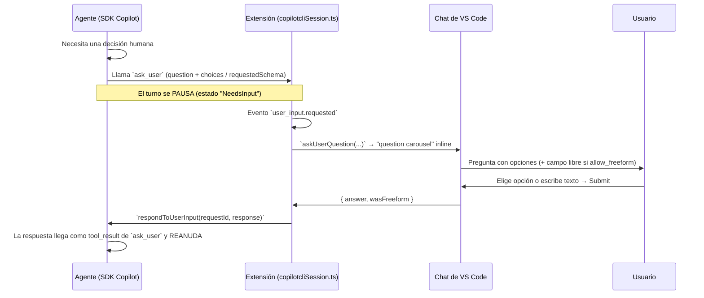

# HITL en el agente de VS Code Copilot — la tool `ask_user` y su mapeo a Sigma

> Referencia de la fábrica (2026-08-10). Investiga cómo VS Code Copilot implementa el
> human-in-the-loop (HITL) en su agente de código y qué implica para el diseño del
> componente `Questionnaire` de Sigma. Verificado contra el código fuente actual de
> `microsoft/vscode` en `main` (no docs de marketing).

## Resumen

El agente Copilot no "pregunta" escribiendo texto: tiene una **tool interactiva llamada
`ask_user`** que **pausa el turno** hasta que el humano responde. La respuesta se le
entrega al modelo como si fuera el resultado de una tool normal, y el agente **reanuda**
con esa información. El `Questionnaire` de Sigma es la implementación "surface" de este
mismo patrón: el agente detecta que una decisión requiere al humano, pausa, muestra el
cuestionario y continúa con la respuesta.

## La tool `ask_user`

Definida en `extensions/copilot/src/extension/chatSessions/copilotcli/common/copilotCLITools.ts`:

```ts
type AskUserTool = {
  toolName: 'ask_user';
  arguments:
    | { question: string; choices?: string[]; allow_freeform?: boolean }
    | { message: string; requestedSchema: { properties: Record<string, unknown>; required?: string[] } };
};
```

Dos formas:

1. **Pregunta simple**: `question` + opciones (`choices`) + si se permite respuesta libre
   (`allow_freeform`). → equivale a un `Questionnaire.Item` con `Choice`s + `Input` libre.
2. **Formulario estructurado**: `message` + **JSON Schema** de campos (`requestedSchema`,
   con `properties` y `required`). → equivale a una gate con varios campos (inputs/selects)
   que el agente necesita para ejecutar (p. ej. material, cantidad, fecha).

## El flujo HITL completo



Puntos clave del código (`copilotcliSession.ts`):

- El handler de `user_input.requested` construye `IQuestion { question, options, allowFreeformInput }`
  y llama a `_userQuestionHandler.askUserQuestion(...)`, que renderiza el **carousel de
  preguntas** en el panel de chat.
- La respuesta se convierte con `toSdkUserInputResponse`: opción elegida → `{ answer: selected.join(', '), wasFreeform: false }`;
  texto libre → `{ answer: freeText, wasFreeform: true }`.
- Se devuelve al SDK con `respondToUserInput(requestId, response)` y el agente continúa.

## La capa generalizada: protocolo "agent host"

`src/vs/platform/agentHost/` define el mismo patrón de forma agnóstica al agente (Copilot,
Claude, Codex lo implementan):

- `ChatInputRequest` con `purpose: ChatInputRequestPurpose.AskUser` y `questions: ChatInputQuestion[]`.
- Seis tipos de pregunta (`ChatInputQuestionKind`): `text`, `number`, `integer`, `boolean`,
  `single-select`, `multi-select`. Cada una con `options`, `allowFreeformInput`, `min/max`,
  `defaultValue`, `required`.
- La UI renderiza el **carousel inline** en el chat (`createInputRequestCarousel` en
  `agentHostSessionHandler.ts`); al responder, `convertCarouselAnswers(...)` convierte las
  respuestas y se despacha `ChatInputCompleted { response: Accept, answers }`.
- **Anti-bloqueo por timeout**: si nadie reclama la pregunta en `UNOBSERVED_CLIENT_TOOL_GRACE_MS`
  (5000 ms), se auto-cancela con `ChatInputResponseKind.Cancel` para que el agente no quede
  colgado esperando una UI que nunca apareció (p. ej. una gate en una sesión oculta o un
  subagente sin vista).

## Otros gates HITL del agente (además de `ask_user`)

| Gate | Evento | UI | Modo autopilot |
|---|---|---|---|
| Permisos de tool (read/write/shell/MCP/url) | `permission.requested` | Tarjeta aprobar/denegar | auto-aprueba |
| Aprobación de plan | `exit_plan_mode.requested` | "Ready to code?" (plan + aprobar) | auto-aprueba |
| Confirmación de tool call | `PendingConfirmation` | Tarjeta de confirmación (Approve/Deny u opciones custom) | auto-aprueba |
| **Pregunta al usuario** | **`ask_user` / `user_input.requested`** | **Question carousel inline** | **no se puede auto-aprobar** |

Con `permissionLevel: 'autoApprove' | 'autopilot'` (o sandbox activo) los gates de permiso
se resuelven solos y el agente corre desatendido. La pregunta al usuario **siempre** requiere
humano (si nadie la responde, se cancela por timeout, nunca se auto-responde).

## Mapeo al Questionnaire de Sigma

| Concepto Copilot | En Sigma |
|---|---|
| `ask_user { question, choices, allow_freeform }` | `Questionnaire.Item` + `Choice`s + `Input` libre (demos `Basic`, `Freeform`, `Shortcuts`) |
| `ask_user { requestedSchema }` | Gate con varios campos (inputs/selects) — demo `Form` |
| `ChatInputQuestionKind.single-select` | `Questionnaire.Choice` (radio) |
| `ChatInputQuestionKind.multi-select` | `Choice` con `multiple` (demo `Multiple`) |
| `allowFreeformInput` / `wasFreeform` | `Questionnaire.Input`; la respuesta libre se registra como `wasFreeform` |
| Timeout anti-bloqueo (5s auto-cancel) | Demo `Timeout` (countdown + cancelación) |
| El agente reanuda con la respuesta como tool_result | Demo `Ask → Resume` y `/demo2` |
| Pregunta en un dialog/modal | demo `Dialog` (gate de escritura) |
| `required` / validación | `required` + schema Zod (demo `Validation`) |
| `questionCarousel` inline en el chat | Gate inline dentro del flujo de chat (`/demo2`) |

## Implicaciones de diseño para Sigma

1. **El turno se pausa, no se bloquea**: la gate es un estado del turno ("NeedsInput"),
   no una modal que congela todo. El resto del runtime (hooks, logs, buffer) sigue vivo.
2. **Toda gate debe tener un timeout de cancelación**: si la UI no está disponible
   (sesión oculta, canal que no renderiza), el agente cancela y continúa con una política
   por defecto en lugar de quedarse esperando.
3. **La respuesta entra como tool_result**: el agente no debe "releer" la conversación;
   la respuesta del cuestionario se inyecta como resultado de la tool `ask` y el modelo
   la consume de forma natural.
4. **La pregunta nunca se auto-responde**: solo los gates de permiso pueden auto-aprobarse;
   la pregunta al humano es el único gate que siempre espera (o se cancela).
5. **Superficie lineal, core procedural**: el usuario ve una pregunta simple con opciones;
   nunca ve el SP/entidad/skill que el agente consultó (ver convención "surface simple,
   core procedural interno").

## Referencias de código (microsoft/vscode, `main`)

- Tool `ask_user` + formatters: `extensions/copilot/src/extension/chatSessions/copilotcli/common/copilotCLITools.ts`
- Flujo `user_input.requested` → carousel → `respondToUserInput`:
  `extensions/copilot/src/extension/chatSessions/copilotcli/node/copilotcliSession.ts`
- Protocolo `ChatInputRequest` / `ChatInputQuestion` / `ChatInputAnswer`:
  `src/vs/platform/agentHost/common/state/protocol/channels-chat/state.ts`
- Carousel + auto-cancel por grace window: `src/vs/workbench/contrib/chat/browser/agentSessions/agentHost/agentHostSessionHandler.ts`
- Equivalentes en otros agentes: `AskUserQuestion` (Claude) y `request_user_input` (Codex)
  en `src/vs/platform/agentHost/node/{claude,codex}/`
