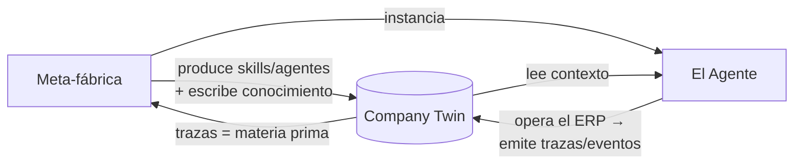

# Sigma AGI — Arquitectura

El marco de nivel superior. **Esta es la primera lente con la que se entra a todo lo demás.** Todos los otros documentos del proyecto cuelgan de una de las tres abstracciones que se definen aquí.

> **La idea en una frase:** Sigma son **tres abstracciones** —Meta-fábrica, Agente y Company Twin— que forman un **loop compuesto cerrado**, gobernadas por una **ley transversal** (Governance). Nada más es fundamental; todo lo demás es estructura interna de una de las tres.

---

## 1. Las tres abstracciones

| Abstracción | Es el… | Responde | Naturaleza |
|---|---|---|---|
| **Company Twin** | sustantivo: lo que Sigma *sabe* | "¿qué sé?" | Estado / memoria / world model |
| **El Agente** | verbo: lo que Sigma *hace* | "¿cómo opero?" | Ejecución en runtime |
| **La Meta-fábrica** | productor: cómo Sigma *aprende a hacer* | "¿cómo creo capacidad?" | Producción de capacidad |

### 1.1 Company Twin — lo que Sigma sabe
El sustrato de memoria. Todo lo que Sigma conoce y recuerda entre corridas, sesiones y usuarios. Es el **activo estratégico** (lo único que no se reemplaza).

Contiene internamente:
- **ERP Kernel** — conocimiento universal de Intelisis (wiki, reglas).
- **Context stack** — las 5 capas separadas por velocidad de cambio (ver [`context-stack.md`](./context-stack.md)).
- **Process Graph** — cómo fluye el trabajo + estado de cada loop.
- **Event Ledger** — el log append-only de todo lo que ocurrió.

### 1.2 El Agente — lo que Sigma hace
La ejecución en runtime. Lee el Twin, opera el ERP de forma gobernada, escala a humanos cuando el riesgo lo exige.

Contiene internamente:
- **Loops** persistentes (el modelo de ejecución, ver [`tesis.md`](./tesis.md)).
- **Agent Cortex** — subagents especialistas (consultor / operador / validador / DRI).
- El ladder de autonomía (Shadow → … → Controlled).

### 1.3 La Meta-fábrica — cómo Sigma aprende a hacer
La capa que **produce capacidad**. Compila operación real en skills ejecutables y mejora el sistema con cada corrida.

Contiene internamente:
- **Trace2Skill** — trazas SQL → skills versionados.
- **Knowledge Factory** — pipeline SDK/trazas → ERP Kernel + wiki + reglas.
- **Evals** — el control de calidad: decide cuándo un skill/loop está listo para subir de autonomía.
- **Cross-client learning** — patrones entre implementaciones (ver [`inteligencia-consultora.md`](./inteligencia-consultora.md)).

---

## 2. El loop compuesto (por qué cierran)

Las tres no son piezas sueltas: forman un ciclo que se profundiza con cada vuelta.



1. La **Meta-fábrica** produce capacidad (compila trazas → skills), la escribe en el **Twin** e instancia **Agentes**.
2. El **Agente** lee el Twin, opera, y al operar **emite eventos** de vuelta al Twin.
3. Esos eventos son la materia prima que la **Meta-fábrica** vuelve a minar.

El **Company Twin es el sustrato compartido** que las otras dos leen y escriben. Por eso es el activo: el LLM, los agentes y los skills son reemplazables; el estado acumulado no.

Es el bucle compuesto de Block: **más datos → mejor modelo → mejores decisiones → más datos.**

---

## 3. La ley transversal: Governance

Governance **no es una cuarta abstracción**. Es la **constitución** que las tres obedecen — la física, no un actor. Vive en dos fronteras:

- **El `act` del Agente** — toda escritura al ERP pasa por approval gates, evidencia, idempotencia y receipt.
- **La promoción de la Meta-fábrica** — ningún skill/loop sube en el ladder de autonomía sin que sus evals lo respalden.

```
        ┌─────────────── GOVERNANCE (ley transversal) ───────────────┐
        │                                                            │
        │   Meta-fábrica  ──produce──►  Company Twin  ◄──opera──  Agente   │
        │        ▲                          │                    │   │
        │        └────────── eventos ───────┴──── contexto ──────┘   │
        │                                                            │
        └────────────────────────────────────────────────────────────┘
```

Formulación final:

> **Tres abstracciones (Meta-fábrica, Agente, Company Twin) + una ley transversal (Governance).**

---

## 4. Validación: mapeo a Block

La estructura de tres es el núcleo del modelo "From Hierarchy to Intelligence" de Block, menos las interfaces (que son entrega, no abstracción core):

| Block | Sigma |
|---|---|
| World model | **Company Twin** |
| Intelligence layer | **El Agente** |
| Capabilities (primitivas difíciles de construir) | lo que produce **la Meta-fábrica** |
| Interfaces | superficies (north-star, no abstracción core) |

---

## 5. Cliente vs consultora: la misma fábrica en dos niveles

La distinción que parecía dos productos es en realidad **la misma Meta-fábrica operando en dos niveles**:

| Nivel | Qué compila la Meta-fábrica | Qué recuerda el Twin | Qué hace el Agente |
|---|---|---|---|
| **Cliente** | skills para operar *un* ERP | Company Twin de *esa* empresa | loops que operan el ERP del cliente |
| **Consultora** | patrones *entre* implementaciones | world model de todas las implementaciones | DRI que poseen problemas cross-client |

Misma arquitectura, distinto alcance. Se construye el nivel cliente primero (ver [`inteligencia-consultora.md`](./inteligencia-consultora.md)).

---

## 6. Dónde cuelga cada documento

Todo lo documentado pertenece a una de las tres abstracciones (o a la ley transversal):

| Documento | Cuelga de |
|---|---|
| [`context-stack.md`](./context-stack.md) | **Company Twin** (su estructura interna) |
| [`tesis.md`](./tesis.md) | **El Agente** (loops, ejecución) |
| [`inteligencia-consultora.md`](./inteligencia-consultora.md) | **La Meta-fábrica** (nivel cross-client) |
| [`decisiones.md`](./decisiones.md) | **La Meta-fábrica** (evals/QC) + Governance |
| [`mercado.md`](./mercado.md) | Posicionamiento del conjunto |
| [`glosario.md`](./glosario.md) | Vocabulario del conjunto |

---

## 7. Por qué tres y no más

Tres abstracciones es **memorable, vendible y completo**. Cuatro ya se siente arquitectura de ingeniería. La disciplina:

- **No** convertir Governance en una cuarta caja: es la ley que envuelve, no un actor.
- **No** convertir las superficies/interfaces en una abstracción core: son entrega (north-star).
- **No** separar ERP Kernel del Company Twin como abstracción aparte: es estructura *interna* del Twin (el conocimiento universal es la capa más lenta del Twin).

> Si algo nuevo no encaja en Meta-fábrica, Agente o Company Twin, primero pregúntate si es estructura interna de una de las tres antes de proponer una cuarta abstracción.

---

## Documentos relacionados
- [`tesis.md`](./tesis.md) — El Agente (loops persistentes), modelo de ejecución.
- [`context-stack.md`](./context-stack.md) — Estructura interna del Company Twin.
- [`inteligencia-consultora.md`](./inteligencia-consultora.md) — La Meta-fábrica a nivel cross-client.
- [`decisiones.md`](./decisiones.md) — Decisiones arquitectónicas (ADRs).
- [`mercado.md`](./mercado.md) — Posicionamiento.
- [`glosario.md`](./glosario.md) — Vocabulario.

---

*Arquitectura — 2026-06-25. Marco de nivel superior del proyecto Sigma AGI: tres abstracciones (Meta-fábrica, Agente, Company Twin) + Governance transversal.*
