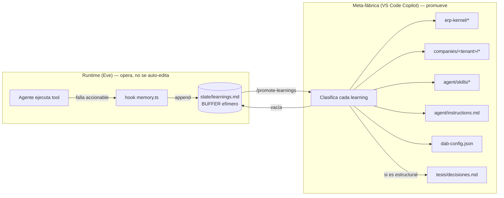

# Constitución del stack Sigma

> Documento normativo. Define **qué es responsabilidad de cada capa** y **dónde vive
> cada tipo de conocimiento**. Es el schema que la Meta-fábrica (VS Code Copilot) y el
> runtime (Eve) deben respetar. Si un cambio no encaja limpio en esta constitución,
> primero se ajusta la constitución (y se registra en [decisiones.md](decisiones.md)),
> no se mete el conocimiento en el lugar equivocado.
>
> Complementa [arquitectura.md](arquitectura.md) (las 3 abstracciones) y
> [context-stack.md](context-stack.md) (las capas del Twin). Aquí se asignan **dueños**.

---

## 0. Principio raíz

**Cada hecho vive en UN solo lugar, propiedad de UNA sola capa, y se escribe por UN solo
actor.** La duplicación es deuda: cuando el mismo hecho aparece en dos capas, tarde o
temprano divergen (fue el caso de `ABIERTO`→`PENDIENTE`, que tocó 4 archivos). La
eficiencia del stack se mide por cuántos lugares hay que tocar para cambiar un hecho:
el objetivo es **siempre uno**.

---

## 1. Los planos y su dueño único

| Capa | Contiene | Formato | Velocidad | Quién ESCRIBE |
|---|---|---|---|---|
| **DAB (MCP tools)** | *Capacidad de ejecución*: qué operaciones existen sobre el ERP (read/aggregate/create/update/delete/execute), qué operadores OData soporta el motor, límites del protocolo. | .NET / `dab-config.json` | Muy lento (release DAB) | Fábrica (rebuild DAB) |
| **Eve (agent framework)** | *Orquestación*: cómo se ejecuta el loop, hooks, subagents, approval gates, memoria de sesión (`defineState`), overlays (`defineDynamic`). Cableado, no conocimiento de dominio. | TypeScript (`agent/`) | Medio | Fábrica |
| **ERP Kernel** (`company-twin/erp-kernel/`) | *Declarativo universal de Intelisis*: entidades, campos, tipos, ciclo de vida, relaciones, **capacidades transversales del motor (OData)**. `tenant: null`. Jamás datos ni políticas de un cliente. | OKF (markdown + frontmatter) | Lento (release ERP) | Fábrica |
| **Company Twin** (`company-twin/companies/<tenant>/`) | *Declarativo del tenant + políticas*: catálogos reales, límites de aprobación, aprobadores, calendarios, overrides. **Restringe** al kernel, nunca lo amplía. | OKF | Medio/rápido | Fábrica |
| **State / memoria operativa** (`.../<tenant>/state/`) | *Buffer efímero*: aprendizajes crudos capturados en runtime, pendientes de clasificar. **NO es un destino, es una bandeja de entrada.** | markdown append-only | Tiempo real | **Runtime (hook)** — único caso en que el runtime escribe |
| **Skills** (`agent/skills/`) | *Procedural*: cómo ejecutar secuencias (joins manuales, multi-aggregate, resumen ejecutivo, 3-way match). **Cero schema** — referencia al Twin. | markdown (SKILL.md) | Medio | Fábrica |
| **Instructions** (`agent/instructions.md`) | *Identidad + ruteo (thin)*: quién es el agente y a qué fuente ir para cada necesidad. **Cero schema, cero procedural.** | markdown | Lento | Fábrica |
| **Runtime cableado** (`agent/instructions/*.ts`, `hooks/`, `tools/`) | *Overlays y captura*: inyección dinámica de contexto, captura de errores al buffer, tools custom. | TypeScript | Medio | Fábrica |

**Regla de frontera clave:**
- El **motor** (DAB) sabe *qué operaciones y operadores existen* → eso es capacidad, vive en DAB y se documenta **una vez** en el kernel root.
- El **kernel** sabe *cómo es una entidad universal de Intelisis*.
- El **Twin del tenant** sabe *cómo es esta empresa concreta*.
- El **skill** sabe *cómo encadenar tools para lograr un resultado*.
- Las **instructions** solo saben *a dónde ir*.

---

## 2. Reglas de no-duplicación (single source of truth)

Matriz de "tipo de conocimiento → hogar canónico". Si lo encuentras en otro lado, es un bug.

| Tipo de conocimiento | Hogar canónico | Prohibido en |
|---|---|---|
| Capacidades/límites del motor (operadores OData, no-HAVING, no-JOIN, fechas sin comillas) | `erp-kernel/index.md` (§ Capacidades OData) | Módulos (cxp, dinero…), skills, instructions, learnings |
| Schema de una entidad (campos, tipos, estatus, relaciones) | `erp-kernel/<entidad>.md` | instructions, skills, dab-config duplicado |
| Enums/catálogos específicos del tenant | `companies/<tenant>/` | kernel |
| Políticas (límites $, aprobadores, calendarios) | `companies/<tenant>/policies/` | kernel, skills |
| Cómo ejecutar un flujo | `agent/skills/<x>/SKILL.md` | instructions, twin |
| Ruteo "para X usa fuente Y" | `agent/instructions.md` | todos los demás |

**Corolario transversal:** lo que aplica a *todos* los módulos (p. ej. OData) va al **root
del kernel**; cada módulo solo documenta lo **específico** suyo y, si necesita recordarlo,
**apunta** al root en una línea, no lo copia.

**Ley ontológica** (de [context-stack.md](context-stack.md)): *nunca conviertas una
observación local en conocimiento universal sin validación.* Lo universal se hereda, lo
específico se superpone, lo temporal no se guarda como verdad. Un learning observado en un
tenant **no** sube al kernel salvo que se valide como universal.

**Jerarquía de autoridad:** Governance > Company Twin > Skill > ERP Kernel > Runtime Intent.
El Company Twin **restringe**, nunca amplía lo que el kernel permite.

---

## 3. El ciclo de auto-mejora (recursive self-improvement)

Dos actores, roles estrictamente separados:

- **Runtime (Eve / agente Sigma)** — SOLO puede: leer el Twin, ejecutar tools, y **anexar
  al buffer** (`state/learnings.md`) vía el hook cuando algo falla. **Nunca** reorganiza el
  Twin ni promueve conocimiento. El agente opera; no se auto-edita el conocimiento.
- **Fábrica (VS Code Copilot + skills)** — es la ÚNICA que **promueve**: toma el buffer,
  clasifica cada aprendizaje, lo escribe en su hogar canónico (kernel / twin / skill /
  instructions / dab-config), valida y **vacía el buffer**.

**Por qué esta separación:** el runtime es no-determinista y multi-tenant; dejarlo reescribir
el conocimiento universal corrompería el kernel con observaciones locales (viola la ley
ontológica). El buffer desacopla *captura* (barata, en runtime) de *promoción* (deliberada,
en la fábrica, con juicio humano-en-el-loop).

---

## 4. Protocolo de promoción (lo que ejecuta la meta-fábrica)

Implementado por el skill de fábrica
[promote-learnings](../.github/skills/promote-learnings/SKILL.md) (disparable con
`/promote-learnings`). Compila cada entrada del buffer `state/learnings.md` a **una** de las
cuatro capas de capacidad (declarativa / procedural / ejecución / ruteo). Las escrituras al
Company Twin y al ERP Kernel deben ser **conformes a OKF** (Open Knowledge Format):
`type` requerido en frontmatter, links bundle-relativos, `index.md` para progressive
disclosure, `log.md` para historial, `# Citations` para la fuente. Spec:
<https://github.com/GoogleCloudPlatform/knowledge-catalog/blob/main/okf/SPEC.md>.

Resumen del protocolo (detalle completo en el skill §4):

1. **Clasificar** el tipo de conocimiento (matriz del §2).
2. **Decidir alcance**: universal (→ kernel) o específico del tenant (→ company).
   Ley ontológica: en la duda, tenant. Nunca subir a universal sin evidencia.
3. **Determinar destino exacto** (archivo + sección).
4. **Aplicar** (OKF si es Twin/Kernel). Si el hecho ya existe → corregir/mejorar, no duplicar.
5. **Actualizar `index.md`/`log.md`** del bundle afectado.
6. **Validar** (`npm run check`); si tocó dab-config o descripciones de MCP tools, requiere
   rebuild + restart del DAB.
7. **ADR** en [decisiones.md](decisiones.md) si el cambio es estructural.
8. **Vaciar el buffer**: dejar solo el encabezado (o entradas `[pendiente]` justificadas).

---

## 5. Invariantes verificables (candidatos a evals)

- Ningún archivo de módulo del kernel repite el bloque de capacidades OData (solo el root).
- `instructions.md` no contiene tablas de campos ni pasos procedurales.
- Un SKILL.md no contiene schema de entidades (campos/tipos).
- Tras `/promote-learnings`, `learnings.md` solo tiene encabezado o entradas `[pendiente]`.
- El runtime nunca escribe fuera de `state/` (solo el hook, solo append).
