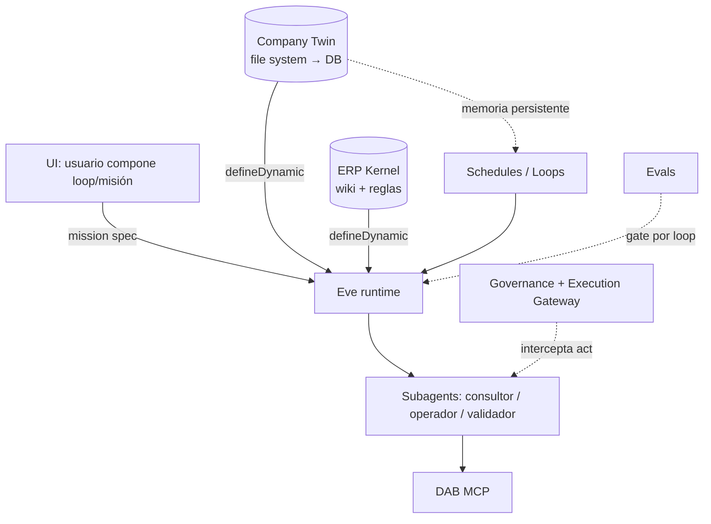

# Sigma AGI — v1

Tesis de investigación para un mini-AGI empresarial sobre Intelisis ERP, reformulada alrededor de **loops persistentes**.

> **Cambio central respecto a v0:** Sigma AGI no es una colección de agentes que responden cuando se les habla. Es una colección de **loops empresariales persistentes** que observan, razonan y actúan sobre la operación de forma continua —incluso cuando nadie les está hablando— anclados a un **Company Twin** que recuerda entre corridas. Los agentes, los loops y el LLM son reemplazables. El estado persistente (Company Twin + Process Graph + Loop State) es el activo estratégico.

> **Linaje:** Esta es la versión v1. La formulación original (Sigma AGI como capa de inteligencia con ERP Kernel, Company Twin, Trace2Skill, Agent Cortex, Execution Gateway, Governance) se conserva íntegra en [`tesis-v0.md`](./tesis-v0.md). v1 no descarta v0: lo reorienta. Toda la arquitectura por capas de v0 sigue vigente; lo que cambia es la **unidad de ejecución**: del *turno conversacional* al *loop con estado*.

---

## 0. Qué cambió y por qué

v0 definió correctamente las capas (ERP Kernel, Company Twin, Process Graph, Trace2Skill, Skill Registry, Context Assembly, Agent Cortex, Execution Gateway, Governance). Pero asumió implícitamente un modelo **request/response**: el usuario pregunta, el agente arma contexto, ejecuta y responde. Ese modelo tiene un defecto estructural que explica por qué los prototipos previos "no terminaban de funcionar":

> Un agente olvida todo entre corridas. Un loop no.

Cada conversación empezaba de cero, redescubría el 85% de su contexto, y dependía de que un humano la iniciara. La inteligencia operativa real de una empresa no funciona así: la operación es **continua**. Las órdenes se atrasan a cualquier hora, el flujo de efectivo cambia cada noche, los vencimientos llegan sin que nadie pregunte.

La corrección es pasar de:

```
ERP + LLM          (v0 temprano)
ERP + Agent        (v0)
```

a:

```
ERP → Company Twin → Persistent Loops → Agents → Humans   (v1)
```

Donde el orden importa: el **Company Twin** (memoria) precede a los **Loops** (objetivo continuo), que orquestan **Agents** (ejecución de pasos), que escalan a **Humans** (gobierno y aprobación). El LLM es el motor intercambiable en el fondo, no el centro.

---

## 1. La idea: Loop Engineering

Un *loop* es un proceso persistente que persigue un objetivo de negocio de forma continua. No es un cron tonto que ejecuta un script; es un agente con estado que en cada ciclo **observa** el mundo, **decide** si hay algo que hacer, **actúa** dentro de gobierno y **actualiza su memoria**.

### 1.1 Tres niveles de madurez

| Nivel | Forma | Limitación |
|---|---|---|
| **Prompt** | "Analiza las órdenes atrasadas" → una respuesta | Sin herramientas, sin estado |
| **Agent** | Consulta ERP, genera reporte, responde | Una ejecución única; olvida al terminar |
| **Loop** | Persigue "reducir órdenes atrasadas" indefinidamente | Recuerda, reevalúa, repite |

Sigma debe operar en el Nivel 3. La diferencia no es cosmética: en el Loop **el estado se vuelve más importante que el prompt**.

### 1.2 Anatomía de un loop

```yaml
goal: Reducir faltantes de inventario
trigger:
  cron: "*/30 * * * *"        # cada 30 minutos
observe:
  - inventory
  - forecast
  - open_po
decide:
  - detect_risk
act:
  - create_recommendation
  - notify_buyer
memory:
  - company_twin              # estado que persiste entre corridas
stop_condition:
  - inventory_risk < 5%
```

Cada uno de estos campos mapea a una primitiva real del runtime (sección 3).

### 1.3 La frase que define el activo

> "The agent forgets everything between runs. The loop does not."

Esto reordena la inversión de ingeniería. El valor defendible **no** está en el prompt, ni en el modelo, ni en el agente. Está en el **estado persistente**: el Company Twin es, literalmente, la memoria del loop. Por eso siempre convergemos a él.

---

## 2. Arquitectura v1: capas reorientadas a loops

La arquitectura por capas de v0 se conserva. v1 aclara el **mapeo** entre los componentes del loop (vocabulario de Loop Engineering) y las capas de Sigma, corrigiendo imprecisiones de borradores previos:

| Componente del loop | Capa Sigma | Naturaleza | Dónde vive |
|---|---|---|---|
| Conocimiento de capacidades | **ERP Kernel** | Conocimiento estático universal | Archivos versionados (wiki + reglas) |
| `memory` | **Company Twin** | Estado persistente por empresa | **Store externo** (file system → DB) |
| `state` del flujo | **Process Graph** | Definición + avance de cada loop | Store externo |
| `observe` / `act` (conectores) | **Connections** | MCP / DAB / SDK | Runtime |
| `decide` (razonamiento) | **Agent Cortex** | Subagents especialistas | Runtime |
| `trigger` | **Schedules** | Cron del loop | Runtime |
| `act` gobernado | **Execution Gateway + Governance** | Gates por riesgo + evidencia | Runtime |

### 2.1 Corrección clave sobre el estado

Un borrador previo mapeó "Memory → Company Twin" y "State → Process Graph" como si ambos fueran memoria del agente. Es impreciso y tiene consecuencias arquitectónicas:

- **ERP Kernel** es *conocimiento*, no *estado*. Es universal (todos los clientes Intelisis lo comparten), inmutable entre corridas, y se compila desde el SDK + trazas. No cambia cada 30 minutos.
- **Company Twin** es *estado* persistente, específico de cada empresa, que **debe sobrevivir entre corridas, sesiones y usuarios**. Por definición **no** puede ser memoria efímera de sesión.
- **Process Graph** es la definición de los loops más su avance actual (qué paso va, qué pendientes hay).

> **Modelo de contexto completo →** Esta separación se desarrolla en detalle en el documento complementario [`context-stack.md`](./context-stack.md): el stack de 5 capas separadas por velocidad de cambio (Intelisis Core, Vertical, Company Twin, Process/Skill, Runtime), la regla ontológica ("lo temporal no se guarda como verdad"), la jerarquía de autoridad (`Governance > Company Twin > Skill > Process Graph > ERP Kernel > Runtime Intent`, donde el Company Twin *restringe, nunca amplía*) y los context overlays como composición. Si la tesis define **cómo ejecuta** Sigma (loops), el context stack define **qué contexto compone** para actuar bien.

### 2.2 La jerarquía de reemplazabilidad

```
ERP                  ← sistema de registro (Intelisis, inmutable para nosotros)
  ↓
Company Twin         ← ACTIVO ESTRATÉGICO (memoria persistente)
  ↓
Persistent Loops     ← reemplazables
  ↓
Agents               ← reemplazables
  ↓
LLM                  ← reemplazable
  ↓
Humans               ← gobierno y aprobación
```

Todo lo de abajo del Company Twin es intercambiable. Esto define la prioridad de construcción: **primero el schema del Company Twin y el Event Ledger; después los loops; al final, afinar el modelo.**

---

## 3. Eve como runtime de loops

La elección de [Eve](https://eve.dev) se valida porque sus primitivas mapean **literalmente** (no por analogía) a la anatomía del loop. No hay que inventar el motor de loops: ya existe.

| Anatomía del loop | Primitiva Eve | Notas |
|---|---|---|
| `trigger: cron` | `defineSchedule` | Cron de 5 campos, granularidad de minuto, **root-only** |
| `observe` | `connections/` (MCP → DAB) | `read_records`, `aggregate_records` |
| `decide` | subagents + built-in `agent` tool | Agent Cortex |
| `act` end-to-end | `Workflow` (experimental) + subagents | Orquestación fan-out / map-reduce |
| memoria de **corrida** | `defineState` | Durable **por sesión**, no entre sesiones |
| memoria **persistente** (Company Twin) | **store externo** (file system → DB) | Eve lo exige explícitamente |
| `act` gobernado | `needsApproval` + hooks | HITL, approval gates |
| verificación | framework de **evals** | `defineEval`, gates ejecutables |

### 3.1 El loop como `schedule`

Cada loop empresarial (Compras, Producción, Finanzas) es un archivo bajo `agent/schedules/`. Eve lo dispara en su cron sin intervención. En forma mínima:

```ts
// agent/schedules/finanzas.ts
import { defineSchedule } from "eve/schedules";

export default defineSchedule({
  cron: "0 2 * * *",                  // cada noche 02:00
  markdown: "Revisa CXP con vencimiento en los próximos 7 días, proyecta el " +
            "flujo de efectivo, y reporta riesgos de liquidez al Company Twin.",
});
```

### 3.2 La restricción que define todo: dónde vive el estado

La documentación de Eve es explícita:

> `defineState` holds conversation-scoped working memory that lives and dies with the session. Anything that has to **outlive the session, be shared across sessions or users, or be queried independently** belongs in an **external store** (a connection or your own database).

**Consecuencia directa:** el Company Twin —el activo estratégico— **no puede ser `defineState`**. `defineState` solo sirve para la memoria de _una_ corrida del loop (un contador, el plan actual, un checklist temporal). El Company Twin vive **afuera** del runtime.

Esto, lejos de ser un problema, *refuerza* la tesis: Eve te empuja a poner el activo deliberadamente fuera del agente, donde es consultable, versionable y auditable de forma independiente del modelo.

### 3.3 Company Twin como file system (decisión v1)

Para esta iteración: **el Company Twin se hardcodea como file system.** Más adelante migra a una base de datos consultable (Postgres/pgvector). Esto es coherente con la advertencia de Eve (store externo) y mantiene la simplicidad inicial:

```
company-twin/
├── STATE.md                 # estado vivo de la empresa (hardcoded por ahora)
├── policies/                # políticas: aprobadores, límites, calendarios
│   ├── tesoreria.md
│   └── compras.md
├── org/                     # roles, sucursales, usuarios clave
├── decisions/               # historial de decisiones (append-only)
└── loops/                   # estado de cada loop
    ├── finanzas.state.json
    └── compras.state.json
```

Los loops y subagents leen el Company Twin desde disco vía `defineDynamic` (resuelve skills/instructions por empresa en `session.started`). Cuando el Twin migre a DB, solo cambia el adaptador de lectura; la arquitectura de loops no se toca.

---

## 4. El ladder de autonomía aplicado a loops

El mayor riesgo de v1 es obvio: **un cron que escribe al ERP sin supervisión es lo más peligroso que se puede construir.** El ladder de autonomía de v0 sigue siendo la respuesta, ahora aplicado a cada loop:

| Etapa | El loop puede… | `act` habilitado |
|---|---|---|
| **Shadow** | Observar, decidir, explicar | ❌ ninguno |
| **Recommend** | Proponer acciones a un humano | ❌ solo notifica |
| **Assisted** | Preparar borradores + simular | ❌ requiere aprobación |
| **Approval** | Ejecutar tras aprobación humana | ✅ con gate HITL |
| **Controlled** | Ejecutar dentro de límites whitelisted | ✅ acotado |

**Regla de oro v1:** *todo loop nace en Shadow.* No avanza de etapa hasta que sus evals de `observe → decide` pasan de forma consistente. La escritura se *gana*, no se asume.

---

## 5. Desarrollo dirigido por evals

Requisito no negociable: **cada avance se verifica con evals.** Eve trae un framework de evals completo que convierte "creo que funciona" en "el eval pasa o no pasa". Esto ataca directamente la causa por la que prototipos previos se abandonaron: no había forma objetiva de saber si funcionaban.

```ts
// Un loop financiero en shadow: ¿detecta el riesgo correcto sin escribir nada?
await t.send("Ejecuta el ciclo nocturno de finanzas");
t.calledTool("aggregate_records", { input: { entity: "CxpPendiente" } });
t.notCalledTool("create_record");        // shadow: prohibido escribir
t.notCalledTool("update_record");
t.toolOrder(["aggregate_records", "read_records"]);  // dimensiona antes de detallar
t.judge.factual("identificó los vencimientos correctos");  // grading semántico
```

Los `.gate()` hacen fallar el CI. Cada loop tiene una suite de evals que **define** cuándo puede subir de etapa en el ladder de autonomía. Los evals son el mecanismo de gobierno técnico: el Execution Gateway en forma de test.

### 5.1 Eval-first sobre architecture-first

En vez de diseñar todos los subagents por adelantado, escribimos primero los evals de misiones/loops reales y dejamos que **fallen**. Los evals definen qué subagentes, skills y reglas hace falta construir. Construimos hasta que el eval pasa. Repetimos.

---

## 6. Loops de referencia

Catálogo inicial (todos arrancan en Shadow):

### Loop Financiero (primer MVP recomendado)
```yaml
goal: Optimizar flujo de efectivo y anticipar riesgos de liquidez
trigger: { cron: "0 2 * * *" }     # nocturno
observe: [CxpPendiente, CxpSaldo, DineroSaldo, CtaDinero]
decide: [proyectar_efectivo, detectar_vencimientos, detectar_riesgo_liquidez]
act: [reportar_al_twin]            # shadow: solo escribe al Company Twin, no al ERP
memory: [company_twin]
stop_condition: [sin_riesgos_criticos]
```
Cero riesgo (no toca el ERP), máximo aprendizaje, valida toda la maquinaria.

### Loop de Compras
```yaml
goal: Evitar faltantes de inventario
trigger: { cron: "*/30 * * * *" }
observe: [inventario, forecast, ordenes_abiertas]
decide: [detectar_riesgo_faltante]
act: [crear_recomendacion, notificar_comprador]   # Recommend, no escribe al ERP
```

### Loop de Producción
```yaml
goal: Maximizar cumplimiento del plan
trigger: { cron: "*/15 * * * *" }
observe: [avance_produccion, plan]
decide: [detectar_desviacion]
act: [alertar_supervisor, proponer_replanificacion]
```

### Loop Ejecutivo
Meta-loop que lee el estado de los demás loops desde el Company Twin y produce un resumen ejecutivo diario. Solo lectura.

---

## 7. Gobierno (sin cambios de fondo respecto a v0)

Los principios no negociables de v0 se mantienen y se intensifican para loops autónomos:

1. No hay escrituras SQL libres en producción.
2. No hay `act` productivo sin loop registrado y en etapa ≥ Approval del ladder.
3. Toda escritura pasa por el Execution Gateway con identidad, empresa, rol, idempotencia y receipt.
4. CONCLUIDO / CANCELADO son inmutables — bloqueado sin excepción.
5. Cada corrida de loop es replayable y deja lineage en el Event Ledger.
6. Un loop que se "park" esperando aprobación humana (HITL) resume donde quedó tras la respuesta.

Approval gates por monto/riesgo (BAJO/MEDIO/ALTO/CRÍTICO) idénticos a v0. La diferencia en v1: un loop autónomo en etapa *Controlled* puede proceder solo en operaciones BAJO/MEDIO del whitelist; todo lo demás escala a humano.

---

## 8. MVP v1

**Objetivo:** demostrar el loop completo en pequeño y seguro.

1. **Company Twin hardcodeado** (file system) para una empresa (joya).
2. **ERP Kernel** reutilizado del proyecto previo (wiki + 390 reglas + dab-config universal de 187 entidades).
3. **Un loop financiero nocturno en Shadow**: observa CXP/tesorería, proyecta efectivo, detecta vencimientos, escribe hallazgos al Company Twin. **No toca el ERP.**
4. **Suite de evals** que verifica: dimensiona antes de detallar, no escribe nada, detecta los vencimientos correctos, el reporte es semánticamente correcto.
5. **Agent Cortex mínimo**: subagent `consultor` (read-only) que el loop invoca para observar.

Criterio de éxito: el loop corre solo cada noche, deja un reporte correcto en el Company Twin, y **todos los evals pasan en verde** durante una semana. Solo entonces se considera promover algún loop a etapas con escritura.

---

## 9. Roadmap v1

**Fase 0 — Fundamento (Company Twin + ERP Kernel)**
- Hardcodear Company Twin de joya como file system.
- Portar ERP Kernel (wiki + reglas + dab-config) del proyecto previo.
- Definir el schema del Loop State y del Event Ledger.

**Fase 1 — Primer loop en Shadow**
- Loop financiero nocturno (observe + decide + reportar al Twin).
- Subagent `consultor` read-only.
- Suite de evals que gobierna la promoción.

**Fase 2 — Más loops en Shadow + Recommend**
- Loops de Compras y Producción (Recommend: notifican, no escriben).
- Loop Ejecutivo (meta-loop, solo lectura).
- Company Twin empieza a acumular historial de decisiones.

**Fase 3 — Assisted execution**
- Subagent `operador` + `validador` (task-mode).
- Execution Gateway skeleton + simulación / dry-run.
- Receipts para simulación y denegación.

**Fase 4 — Approval execution**
- Un write path aprobado en staging con HITL obligatorio.
- Idempotency keys + verificación post-escritura.
- Event Ledger completo + replay.

**Fase 5 — Controlled autonomy + plataforma**
- Promover loops low-risk a autonomía limitada.
- Company Twin migra de file system a DB consultable.
- UI donde el usuario compone loops/misiones sobre el Company Twin compartido.

---

## 10. La plataforma final (visión)

El destino no es un set fijo de loops. Es una **plataforma donde el usuario final compone loops y misiones personalizadas** desde una interfaz, todas ancladas al mismo Company Twin (la capa de inteligencia empresarial). Eve lo habilita con `defineDynamic`: tools, skills e instrucciones se resuelven en runtime según la empresa, el usuario y la misión —no se escriben a mano N veces—. La UI emite una *mission spec*; el runtime la materializa contra el Company Twin.



---

## 10bis. Visión / North Star: las cuatro tesis

Más allá del MVP, Sigma apunta a una transformación de cómo opera la empresa. Cuatro tesis de visión, cada una anclada a una primitiva ya existente del sistema (no son fantasía: son la extrapolación de los loops):

| Tesis | Qué significa | Anclaje en Sigma | Estado |
|---|---|---|---|
| **Apps son temporales** | Las superficies (apps, dashboards, flujos) emergen cuando hay una necesidad y desaparecen después; no son productos permanentes | `defineDynamic` materializa superficies por misión | **North-star** (fase 5+) |
| **Workflows son emergentes** | El flujo no se diseña fijo; emerge proceduralmente según contexto, riesgo y carga | El paso `decide` del loop razona la ruta, no la sigue rígida | Parcial (loops v1) |
| **Departamentos son agentes** | Cada área es una unidad cognitiva híbrida (humano + IA): Agente Finanzas, Agente Compras, Agente Inventario | Subagents / DRI artificial ([`inteligencia-consultora.md`](./inteligencia-consultora.md)) | En diseño |
| **Coordinación computable** | La IA modela y ejecuta secuencias organizacionales causales (`ventas sube descuentos → finanzas pierde margen → compras renegocia`) | Process Graph + Company Twin como modelo causal | En diseño |

### La frase de la visión

> Las organizaciones no son workflows. Son **sistemas cognitivos proceduralizados**. Cuando la coordinación se vuelve computable, las apps son temporales, los workflows emergentes y los departamentos se vuelven agentes.

### Dynamic surface generation — north-star, no MVP

La tesis más ambiciosa ("apps son temporales") implica que Sigma detecte un gap → genere una mini-app/dashboard/flujo → la inserte en el flujo → la app desaparezca cuando el problema se va. Técnicamente conecta con `defineDynamic` de Eve (resolver superficies en runtime), pero **es deliberadamente fase 5+**: generar UI dinámica completa es el primo de flujo.ai+WDK que ya se descartó para el MVP. Se persigue bajo la disciplina de [`decisiones.md`](./decisiones.md) ADR-004 (conceptos sí, implementación pesada no antes de tiempo) y ADR-005 (north-star, no MVP). Primero loops en shadow con evals; las superficies dinámicas vienen mucho después.

### Cómo se nombra esta categoría

Sigma es una **Mini-AGI Organizacional** o, más preciso, una **Domain-Bounded Enterprise AGI**: inteligencia general acotada a una empresa Intelisis — no resuelve cualquier problema humano, pero dentro de su dominio entiende contexto, detecta problemas, razona causas, propone soluciones, coordina agentes y ejecuta trabajo con supervisión humana. Definición en [`glosario.md`](./glosario.md).

---

## 11. Tesis final v1

Sigma AGI es una **colección de loops empresariales persistentes y gobernados** sobre Intelisis ERP, anclados a un Company Twin que recuerda entre corridas. Los loops observan, razonan y actúan sobre la operación de forma continua, escalando a humanos cuando el riesgo lo exige. El LLM, los agentes y los loops son reemplazables; el activo estratégico es el **estado persistente** —Company Twin + Process Graph + Loop State—. Cada avance se gana con evals, y toda autonomía se construye desde Shadow hacia arriba.

En una frase: **Sigma AGI es la memoria operativa continua de una empresa Intelisis, ejecutada como loops gobernados y verificados.**

---

## Apéndice — Mapeo Loop Engineering ↔ Sigma ↔ Eve

| Loop Engineering (Osmani) | Sigma (capa) | Eve (primitiva) |
|---|---|---|
| Skills | ERP Kernel | `skills/` + archivos versionados |
| Memory | Company Twin | store externo (file system → DB) |
| State | Process Graph / Loop State | store externo + `defineState` (corrida) |
| Subagents | Agent Cortex | `subagents/` + `agent` tool |
| Connectors | Connections | `connections/` (MCP → DAB) |
| Automation | Governance Layer | `schedules` + `needsApproval` + hooks |
| (verificación) | Execution Gateway | `evals` (`defineEval`, gates) |

---

## Documentos relacionados

- [`context-stack.md`](./context-stack.md) — Modelo de contexto: stack de 5 capas, regla ontológica, jerarquía de autoridad y context overlays. Complementa esta tesis (ejecución/loops) con el **qué contexto compone** Sigma.
- [`decisiones.md`](./decisiones.md) — Registro de decisiones arquitectónicas (ADR). La más importante: **Eve es el runtime único** (no DSL+runner+WDK propio).
- [`mercado.md`](./mercado.md) — Tesis de mercado y posicionamiento (Vertical AI > SaaS; Sigma como OS empresarial).
- [`inteligencia-consultora.md`](./inteligencia-consultora.md) — Nivel meta: aplicar la inteligencia a la propia consultora (cross-client learning, el moat). Scope futuro.
- [`glosario.md`](./glosario.md) — Vocabulario de referencia (Agentic Process Intelligence).
- [`tesis-v0.md`](./tesis-v0.md) — Formulación original (request/response). Linaje preservado.

---

*v1 — 2026-06-23. Sucesor de [`tesis-v0.md`](./tesis-v0.md). Reorienta la arquitectura por capas de v0 alrededor de loops persistentes, sin descartarla.*
